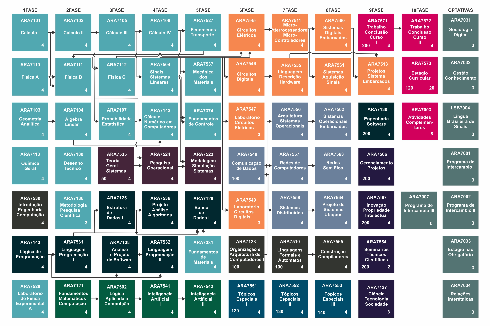

Date: 2014-09-21 18:53
Author: Matheus Francisco
Title: About

<h2>About me</h2>

<h1>Firstly I would like to ask you to read the whole post</h1>
<h1>And forgive my  english..</h1>

<h1>Hello everyone</h1>

My name is Matheus Francisco B. Machado, I was born in 1994 in the interior of São Paulo, I'm an engineering student from the Federal University of Santa Catarina and I graduated this year.

I'll talk little about me, currently I worke with Machine Learning python and javascript at UFSC/CNPq as a scientific initiation My current project is: (Comparison between the use of different data sets for the modeling and identification of at-risk academics can)  Comparação entre a utilização de diferentes conjuntos de dados para a modelagem e identificação de acadêmicos em risco, podem realizar <a href="http://formulario.pibic.ufsc.br/pibicFile/file/520505?tipo=1">Download</a>.  

<h2>A little about my graduate </h2>

The computer engineering course at UFSC campus Araranguá has a curriculum showen in the picture. We have 10 semesters here and a few hours of classes, about 5000 hours...Yeah, I know .. I know.. is alot of class time, but We can't anything. rsrsrs. Perhaps I'll create a post about the work of the curricular chairs... 

<h2>Cool stuff</h2>

A few  cool stuff  I did

I and my friends created  one  makerspace <a href="http://www.araramakerspace.ufsc.br/">Arara Makerspace</a>  <a href="http://www.github.com/araramakerspace/">Arara Makerspace</a>. Basically is a OPEN LAB for the community. We teach and do many things.

I teach Physics for college entrance examination in the PES course <a href="http://www.pes.ufsc.br/">PES-UFSC</a> 

I worked at EJEC <a href="http://www.ejec.ufsc.br/">EJEC</a>.

<h3> Why did I create a blog? </h3>

 As you can see my english is very bad, so I decided to start writing in English to improve this skill.

I'm going to start writing in English.

<h2>My skills</h2>

<ul class="skill-list">
	<li>Python </li>
	<li>Flask</li>
	<li>Django</li>
	<li>I love Data Struct</li>
	<li>HTML/CSS</li>
	<li>Javascript</li>
	<li>Nodejs</li>
	<li>Git/Github</li>
	<li>MySQL</li>
	<li>Postgresql</li>
	<li>MongoDB</li>
	<li>If I do not know, I'll learn.</li>
</ul>

<h2>Goals for 2019  </h2>

<ul class="skill-list">
	<li> Improve my English </li>
	<li> Improve Javascript +++++</li>
	<li> Python learn more about +++</li>
	<li> Improve my Vuejs skill</li>
	<li> Learn about new techs </li>
</ul>

A little more about me <a href="https://github.com/matheusfrancisco/resume-cv">Resume</a>.

<h2>Contact me</h2>

<ul>
	<li><a href="https://github.com/matheusfrancisco/">Github</a></li>
	<li><a data-proofer-ignore href="https://www.linkedin.com/in/matheus-francisco-8797a194">Linkedin</a></li>
	<li><a href="https://twitter.com/@MtChicao">Twitter</a></li>
</ul>

Send me an email and let's talk a little <a href="mailto:matheusmachadoufsc@gmail.com">matheusmachadoufsc@gmail.com</a>.

<a href="mailto:matheusmachadoufsc@gmail.com">m.f.b.machado@grad.ufsc.br</a>.

<a href="mailto:matheusmachadoufsc@gmail.com">contato@matheusfrancisco.com.br</a>.

